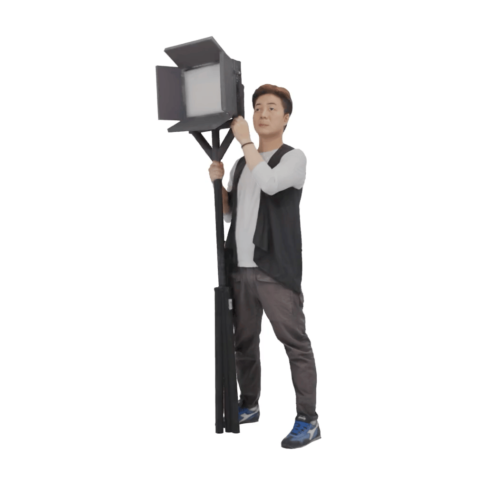
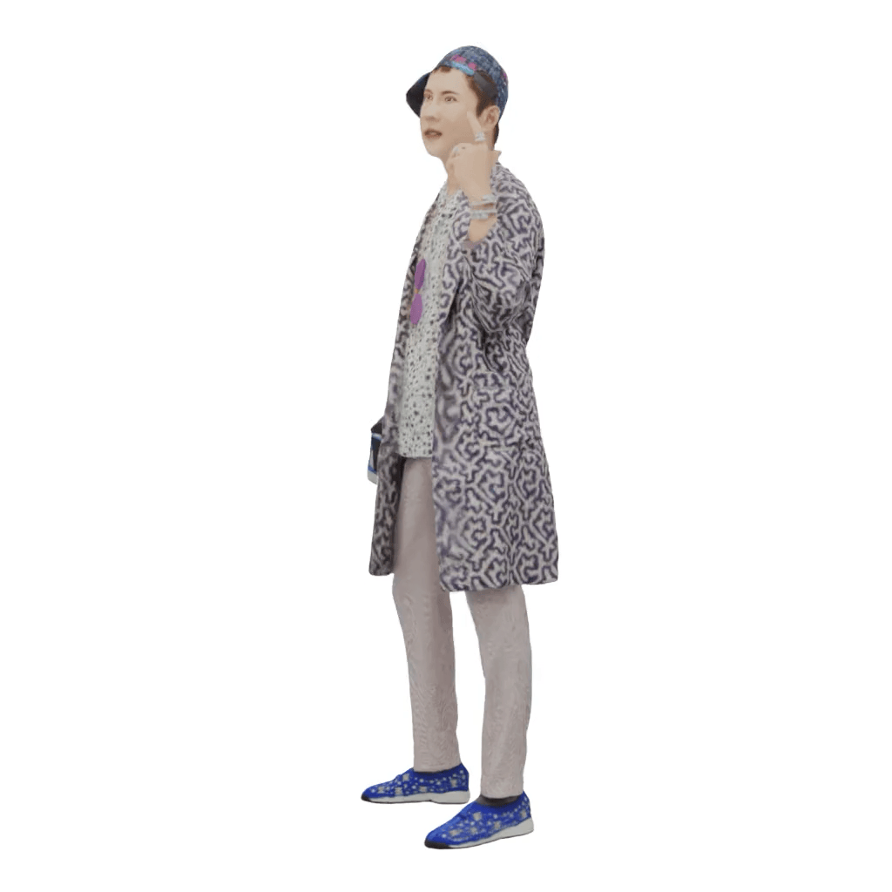
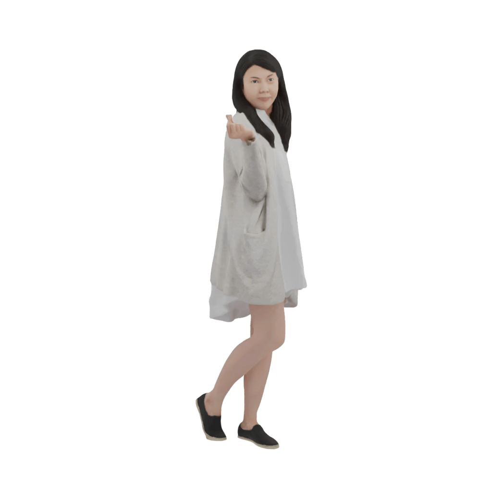
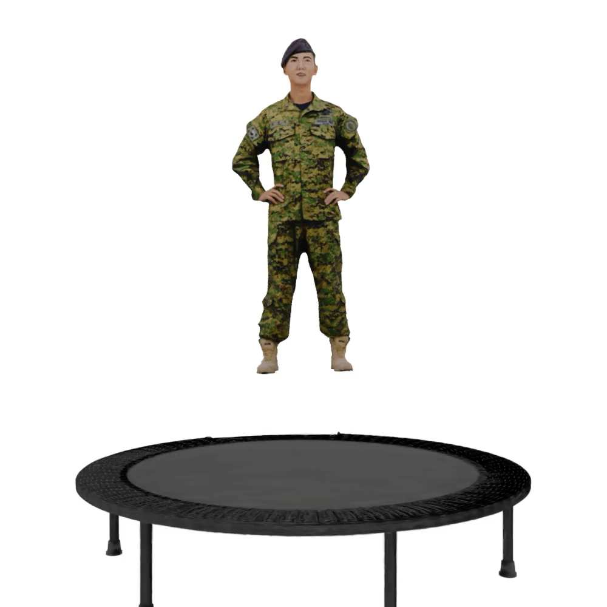
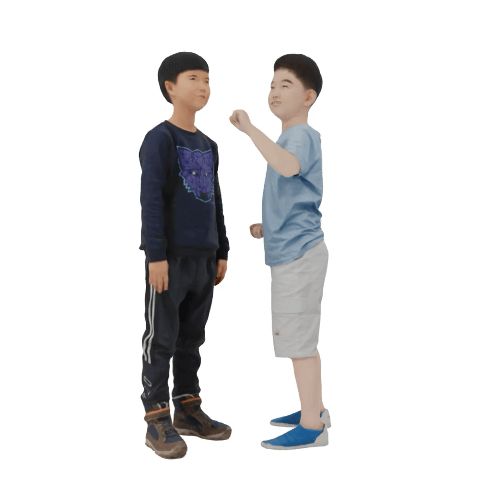

# PhysGaussian Configs for Novel Human Motion and Interaction

This repository contains configuration files for PhysGaussian to generate novel
human motion and interactions using 3D Gaussian Splatting models.

## Overview

PhysGaussian integrates physically grounded Newtonian dynamics with 3D Gaussians
to achieve high-quality novel motion synthesis. This project provides
configurations specifically tailored for human motion and interaction scenarios.

## Prerequisites

- PhysGaussian set up and installed (https://github.com/XPandora/PhysGaussian)
- 3D Gaussian Splatting models

## Usage

To render the simulated motion, use the following command:

`python gs_simulation.py --model_path <path to gs model> --output_path <path to output folder> --config <path to json config file> --render_img --compile_video`

## 3D Gaussian Splatting Model Generation

The 3DGS models used in this project were created through a two-step process:

1. Generating synthetic datasets using BlenderNERF
   (https://github.com/maximeraafat/BlenderNeRF)
2. Running the 3D Gaussian Splatting pipeline
   (https://github.com/graphdeco-inria/gaussian-splatting) on the generated
   datasets

## Results

| | |
|:---:|:---:|
|  |  |
| toppling_lightning_technician.json | dancing_rapper.json |
|  |  |
| wind_dynamics.json | trampoline.json |
|  |  |
| human_punching.json | cliff.json |

